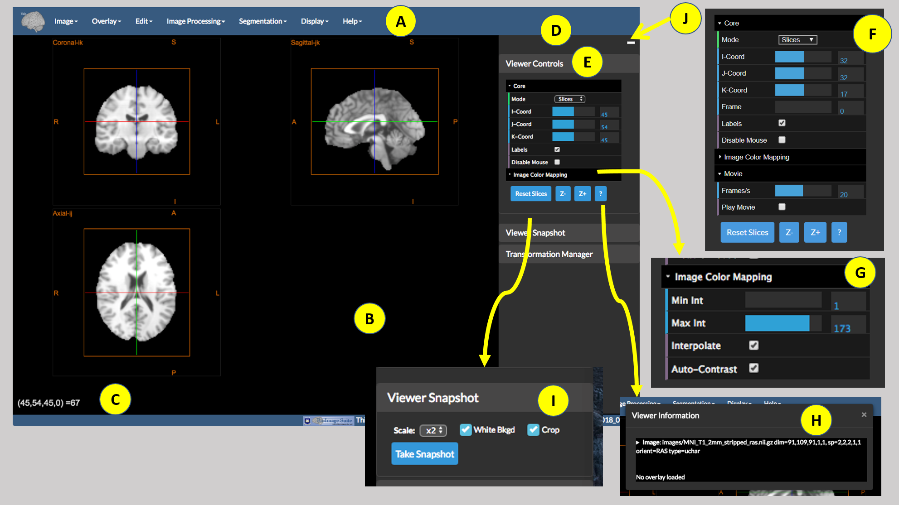

# BioImage Suite Web User Documentation

__Note:__ This document and those linked to it contain the beginnings of the user documentation for [BioImage Suite Web](https://bioimagesuiteweb.github.io/webapp/). A brief introduction to the software can be found in this [presentation](https://bioimagesuiteweb.github.io/webapp/images/BioImageSuiteWeb_NIHBrainInitiativeMeeting_April2018.pdf). If you are looking for developer documentation, this may be found in [the doc directory of the source repository](https://github.com/bioimagesuiteweb/bisweb/tree/master/doc).

BioImage Suite Web consists of three major components

* [The web applications](https://bioimagesuiteweb.github.io/webapp/) which directly run in your browser with no installation required.
* Desktop applications using [Electron](https://electronjs.org/) which may be downloaded from our [download page](http://bisweb.yale.edu/binaries/binaries.html)
* Command line applications which may also be downloaded [from our download page](http://bisweb.yale.edu/binaries/binaries.html). This require a recent version of [Node.js](https://nodejs.org/en/). We recommend v 8.9 or later (but not 9 or 10).

When you open the main BioImage Suite Web web page (or the main electron application) you will see the main page

BioImage Suite Web consists of a collection of applications (which is likely to grow over time.) The list can be accessed under the Applications menu (as shown) and snapshots and brief descriptions of each application can be seen in the carousel (slide show) at the top of the page.

From the menu you can also navigate to the downloads page, the documentation and the source code repository.

---

## Before you Begin

### Download File Location

When using BioImage Suite Web in a web browser all save operations are implemented as download operations, i.e the software creates the data output and initiates a download event. By default most browsers send all downloads to your Downloads directory which is completely unsuitable for using BioImage Suite Web as an analysis software. We recommend going under Settings in your favorite browser as shown below for Chrome:

You need to turn the option `Ask where to save each file before downloading` to `ON`.

For Safari on MacOS see the [description on this web page](https://apple.stackexchange.com/questions/264594/prevent-safari-10-x-from-auto-downloading-files).

### Image Orientations

The Viewers and commandline tools can load images in the [NIFTI-1](https://nifti.nimh.nih.gov/) `.nii.gz` format. A key component of the image is the image orientation. This relates the internal image coordinates to "world" coordinate space.

If we consider a 3-dimensional image matrix `F(i,j,k)` where `i`,`j` and `k` are the coordinate axes in the images where `i,j` are the in-plane directions and `k` is the slice axis. For example in the image shown above for Axial images, `i` is often Left->Right, `j` is Posterior->Anterior. The slice axis `k` is often Inferior->Superior. Such an image is described as having orientation __RAS__ where the letters stand for the direction of the individual axes i.e

* __R:__ i-axis to the RIGHT
* __A:__ j-axis to the ANTERIOR
* __S:__ k-axis to the SUPERIOR

RAS is probably the most common orientation for Neuroimaging research. An alternative orientation that is commonly used (and which the legacy BioImage Suite used) is `LPS` which is 180 degrees rotated w.r.t. RAS (flip i and flip j).

There are 48 (!) possible combinations of orientations. BioImage Suite Web can display all of these (at least as far as we have tested) but also provides the user with the option of converting images `on-load` to RAS or LPS to standardize. Under the Help menu if you select the option `Set Image Orientation on Load` the following GUI appears.

If you select either RAS or LPS then any image load will be repermuted to be in RAS or LPS orientation on load. The settings are stored either in the Browser Database or the text file ${HOME}/.bisweb for commandline and Desktop applications. This is a JSON key-value database file that may look something likes this:

In this case "orientationOnLoad" is set to "None" which preserves the image orientation as is.

---

## An example application

All BioImage Suite web applications share components and have a similar user interface. The picture below shows the `Orthogonal Viewer Tool`.

The application consists of the following parts:

A. The Menu Bar
B. The Viewer (one application has two viewers)
C. The image information under the cursor.
D. The side panel containing viewer controls. (The `_` button at the top right of this minimizes this side panel)
E. The `Viewer Controls` which allow the user to control how the image is displayed. From this one can toggle color mapping  