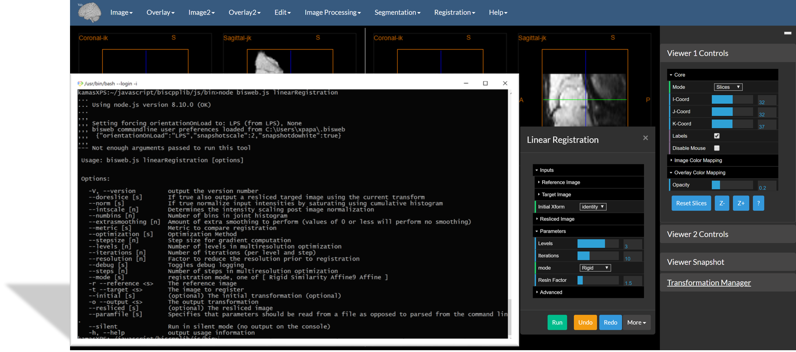

## BioImage Suite Web Command Line Tools

### Introduction

In addition to [web-based applications](https://bioimagesuiteweb.github.io/webapp/) and desktop applications, BioImage Suite Web modules can be accessed as command line applications. This is useful for batch-style processing. You may download the command line tools from [our download webpage](http://bisweb.yale.edu/binaries/binaries.html). The download is a single multiplatform package (works on MacOS, MS-Windows and Ubuntu Linux). The only dependency is Node.js vs 8.x (i.e. the latest version of version 8) which can be found on [the Node.js download site](https://nodejs.org/en/).

_Note:_ Roughly speaking, a modern web browser consists of two parts: (i) the web page rendering engine and (ii) the JavaScript engine. Node.js is based on [V8](https://developers.google.com/v8/), the JavaScript engine in Google Chrome. 

### Installing

There is very little needed. First, download the compressed file and extract it to a folder of your choice. On Unix this might be `/usr/local/bisweb` but any directory will work. As with all tools of a Unix-y heritage, it is best to not use folder names with spaces in them.

Once the files are uncrompressed, a quick `ls` inside the folder will reveal the following contents.

    bin  LICENSE        setpaths.bat  setpaths.sh
    lib  README_js.txt  setpaths.csh  winbin

The actual tools are in the `lib` directory and consist of the JavaScript bundle file `bisweb.js` and the Web-Assembly library `libbiswasm.wasm`. These two files are technically all you need: the rest of the files are there to simplify calling these.

### Using on Unix/MacOS

The first step is to add the tools to your path. You can do this by typing

    source /usr/local/bisweb/setpaths.sh

Replace '/usr/local/bisweb' with the location where you extracted the files if necessary. If you use the csh/tcsh shells replace `setpaths.sh` with `setpaths.csh`. This will add the scripts to your path. 

As an example, to run the smooth image script and get its help page type:

   bw_smoothImage -h

This produces the following:

    ....
    .... Using node.js version 8.9.4 (OK)
    ....
    ,,,,
    ,,,, Setting forcing orientationOnLoad to: None (from None), None
    ,,,, bisweb commandline user preferences loaded from /home/xenios/.bisweb
    ,,,,  {"orientationOnLoad":"None","snapshotscale":2,"snapshotdowhite":true}
    ,,,,
    ---- Not enough arguments passed to run this tool

    Usage: bisweb.js smoothImage [options]

    Options:

        -V, --version       output the version number
        --sigma [n]         The gaussian kernel standard deviation (either in voxels or mm)
        --inmm [s]          Determines whether kernel standard deviation (sigma) will be measured in millimeters or voxels
        --radiusfactor [n]  This affects the size of the convolution kernel which is computed as sigma*radius+1
        --debug [s]         Toggles debug logging
        -i --input <s>      Load the image to be smoothed
        -o --output <s>     Save the output image
        --paramfile [s]     Specifies that parameters should be read from a file as opposed to parsed from the command line.
        --silent            Run in silent mode (no output on the console)
        -h, --help          output usage information

There are over 30 such tools in the `bin` directory that mirror the modules available in the web application.

Here is a side-by-side view of the command line version of the linear registration  tool and the graphical-user interface version in a Web Application. Other than for the code for specifying inputs, parameters and handling the output files, the rest of the code is _identical_ between the two versions.

_Note:_ An observant reader may have noticed that the actual command invoked by bw_smoothImage is `node bisweb.js smoothImage`. The script bw_smoothImage contains the following three lines:

    #!/bin/bash
    DIR="$( cd "$( dirname "${BASH_SOURCE[0]}" )" && pwd )"
    node ${DIR}/../lib/bisweb.js smoothImage $@

The script is just a small wrapper around this command.

### Using On Microsoft-Windows

The process is similar. If the software is installed in a directory `c:\Yale\bisweb` you may add the scripts to your paths using

    c:\Yale\bisweb\setpaths.bat

Then the tools can be executed as for [Unix above](#using-on-Unix/MacOS). The windows tools are in the `winbin` directory and again these are simple scripts that directly mirror the Unix scripts. The same JS/Web Assembly Code is used in either case

    @echo off
    SET DIRNAME=%~dp0
    node.exe %DIRNAME%..\lib\bisweb.js smoothImage %*

