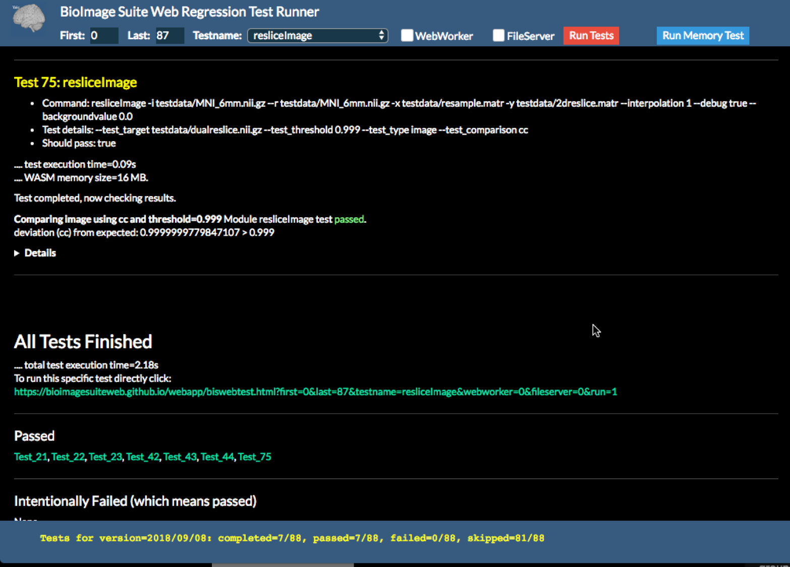
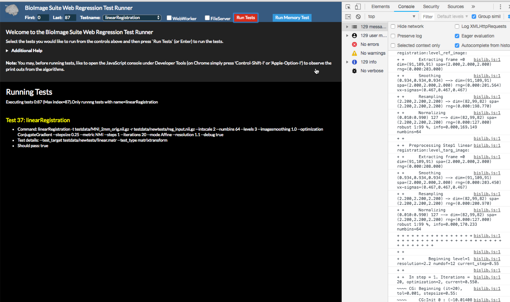

## Verifying BioImage Suite Web for your Environment

BioImage Suite, in a manner rare among software packages,
allows users to run the regression tests on their own computers, using the
__pre-built__ version of the software. We provide a regression
testing application (see below) from which a user can select any test and
run it to verify their own installation (their particular machine, their
particular browser etc.).  All modules in BioImage Suite Web are
regression tested. The tests are simply defined in a JSON file, an example
(abbreviated) entry of which is shown in the figure below (below the
browser). For the curious, the complete list of tests can be downloaded [from this link](https://bioimagesuiteweb.github.io/webapp/test/module_tests.json).

As an aside, we note that these, same tests can be run from the command line from the BioImage Suite web source tree by typing `make test` (see [the developer documentation](https://github.com/bioimagesuiteweb/bisweb/tree/master/docs) for more details). These tests consist of two groups: (i) low-level unit tests and (ii) higher-level module tests. Only the module tests (which as of Sep 2018, number over 85) can be run in the browser.
 
---

### Running Regression Tests in the Browser

First open the BioImage Suite Web Regression Testing Application from [https://bioimagesuiteweb.github.io/webapp/biswebtest.html](https://bioimagesuiteweb.github.io/webapp/biswebtest.html). This is shown in the figure above.

## Selecting Which Tests to Run

One select which tests to run either by index (tests are numbered 0 to 87 -- as of Sep 2018) or by module name, or both. In the figure above, this filtering is performed using the controls marked as `A` and `B` respectively.

* `A` : First and Last test. This simply sets the range of tests to consider running.
* `B` : This sets the name of the test to run (name of the module), or alternatively one can select all modules by choosing `Test all Modules`, or even run a dummy test by selecting `List (but not run) tests`. This last options prints a list of all the tests but does not actually run any.

Under `C` there are two checkboxes that allow the setting of advanced options. If the `Webworker` checkbox is enabled, then all modules are executed in a separate thread in a [Web Worker](https://developer.mozilla.org/en-US/docs/Web/API/Web_Workers_API/Using_web_workers). This is simply testing our internal implementation of these, which are currently not used in the production version of the software. The `FileServer` check is for testing the under development BioImage Suite Web File Server -- more on this in the future.

Finally the buttons `D` and `E` run the tests. 

* `D` : `Run Tests` -- this runs the tests selected by the filtering controls `A` and `B`
* `E` : `Run Memory` -- this runs the memory allocation test for web assembly (more on this below.)

---

## Running Module Tests

The figure above shows an example test run, where we chose to run all the tests of the module `resliceImage` -- this is used to reslice images from one coordinate space to another using a transformation. There are 7 tests for this module as shown in the figure above.

When the test is finished, the status bar at the bottom of the browser shows a summary of what happened (`completed 7/88, passed 7/88, failed=0/88, skipped=81/88`). The 81 skipped tests are thoses tests that do not involve this module and have not been executed.

The log for all tests is preserved in the webpage, and one can scroll up to see the results for each test. In addition, the `Details` tab at the bottom of each test can be expanded to show more details, as is shown below

For some tests, that take longer and/or generate more output, it might be useful to look at the print statements in the JavaScript console. In Google Chrome, this can be opened by pressing 'Control-Shift-I' (Windows/Linux) or 'Apple-Option-I' (Mac) to observe the print outs from the algorithms, as shown in the figure below for an "in process" run of the linear registration test

## Running the Memory Test

This simply verifies that your browser has the ability to allocate upto 2GB of RAM for running the modules implemented in C++ and compiled as WebAssembly (see [this document from the source tree](https://github.com/bioimagesuiteweb/bisweb/blob/master/docs/JStoWASM.md) for more information. Clicking on the the `Run Memory Test` button should yield an output similar to the screenshot below:

