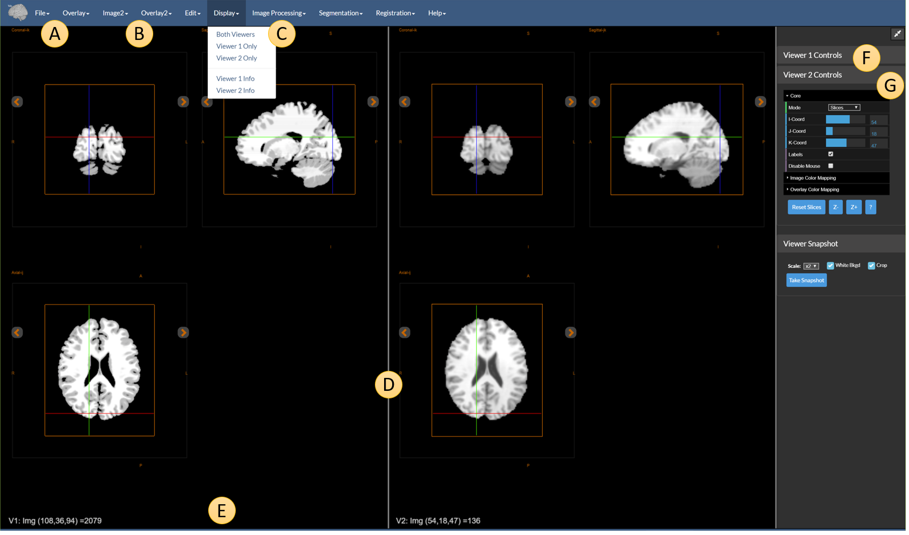
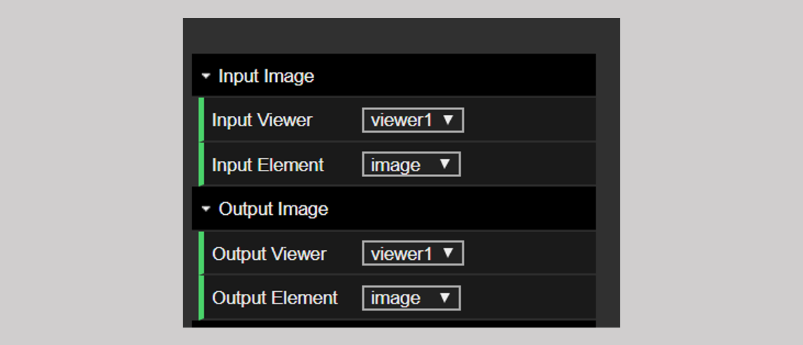
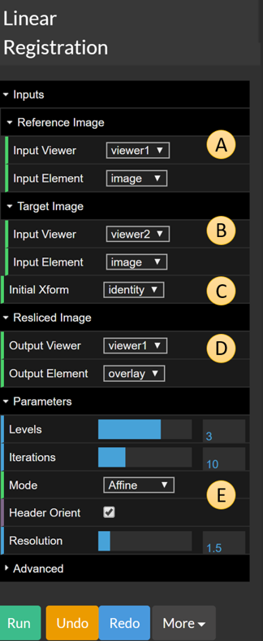

# The Dual Viewer Application

The [Dual Viewer](https://bioimagesuiteweb.github.io/webapp/dualviewer.html) application is the most complex tool in BioImage Suite Web. It allows the user to display two sets of images side-by-side with linked cursors and to manipulate images from either viewer separately or in combination. It is primarily targeted for image registration applications, though advanced users may also take advantage of the extra image display capabilities.

## Differences from the Single Viewer

_Figure 1: The dual viewer with different components highlighted._

Compared to the [regular image viewer](./viewers.md)), you may notice the following:

The two viewers are separated by the dividing line `D`. The relative size of the two viewers can be adjusted by dragging this to the left or the right.

* `A` and `B` — There are two sets of menus for loading and saving images and overlays. `File` and `Overlay` are used to load/save images and overlays for `Viewer 1` and `Image2` and `Overlay2` are used to load/save images and overlays for `Viewer 2`.

* `C` — The `Display` menu, which allows the user to show one or both viewers. 

* `E` — Information about the currently selected area of each image, labelled as `V1` (Viewer 1) and `V2` (Viewer 2).

* `F` and `G` — Each viewer has its own set of controls that function independently; the cursors (viewer cross hairs), however, are linked unless the `Disable Mouse` option is turned on. Note that coordinate conversions are performed in millimeters.

## Image Processing and Segmentation Tools

These are identical to the tools for the single viewer — see the documents [Image Processing](tools/imageprocessing.md) and [Segmentation Tools](tools/segmentation.md). We again highlight here that in the dual viewer you can select the input images in finer detail. As we mention in the description of the image processing tools, there is an additional set of options for setting the `input` and the `output` image in the dual viewer. As shown in the figure below, both the input and the output have an additional "Viewer" tab. In this way, one can choose to `flip` the image in viewer 1 and send the output to `viewer 2` or any one of many other possible combinations. The rest of the functionality is identical.

_Figure 2: The input and output selector tabs for the dual viewer._

## The Registration Tools

One of the most important and unique features of the dual viewer is its ability to run image registration tasks. These can be accessed from the `Registration` menu as shown below.

_Figure 3: The registration tab._

The options are as follows:

* `Transformation Manager` — This shows the transformation manager UI elements, which is where the registration tools store their output transformations. The transformations in this tool may also be used as inputs by the tools which transform images.

* `Reslice Image` — This can be used to reslice an input image using a transformation. It takes three inputs: The `reference` image, which our image will be resliced to, the `input` image, which will be resliced, and the `transformation`, which will be used for the reslicing.

* `Manual Registration` — This can be used to create a manual rigid + scale transformation to manually align two images. The result of this is often used to initialize more automated registrations.

* `Linear Registration` — This can be used to run a linear intensity-based transformation to match two images (e.g. rigid, similarity, affine). This is the basis for the [Deface Image Tool](./tools/defacing.md).

* `Non Linear Registration` — This can be used to run a non-linear B-spline FFD registration between two images. This can be slow!

* `Project` and `Back-Project` Image — These are options used to map 2D optical and 3D MRI images. These tools were originally developed for the needs of a project at Yale.

* `Motion Correction` — This can be used to perform motion correction (serial rigid registration) on a 4D image.

## Running a Linear Registration

This is often a straight-forward process. First load the reference image in `Viewer 1` and then the target image in `Viewer2`. The tool will then try to create a transformation that can be used to reslice the target image to match the reference image using methodology from [Studholme et al](https://www.ncbi.nlm.nih.gov/pubmed/9873927).

### Loading the images to register

`A.` Under the `File` menu, use the `Load Image` option to load the reference image.
`B.` Under the `Image2` menu, use the `Load Image` option to load the target image.

For this example, we use the same images from the `Deface Image Module`, available from these links:

* [Reference Image](https://github.com/bioimagesuiteweb/bisweb/blob/master/test/testdata/deface/sag_2mm.nii.gz)
* [Target Image](https://github.com/bioimagesuiteweb/bisweb/blob/master/web/images/mean_reg2mean.nii.gz)

Once you click on these links, use the "Download" button to download the images.

Once the images are loaded, go to `Registration`->`Linear Registration`. You should see a view similar to the figure below.

_Figure 4: The reference image (left) and target image (right) loaded into the dual viewer._

Note that the two images have different orientations — the one on the left is sagital whereas the one on the right is axial. The registration tools can handle this type of reorientation automatically.

### Computing the Registration

`C.` In the registration tool, set the `Mode` parameter to `Affine`.
`D.` In the registration tool, click the `Run` button.

At this point you may want to observe the computation by opening the JavaScript console in your browser. See the [testing document](./biswebtest.md) for more information on this.

If the registration runs, you will be presented with something like the following:

_Figure 5: A successful reslicing. Note that the console is open in this image._

The resliced version of the input image is overlaid on the reference image using an `Orange` colormap. This can be saved under the `Overlay` menu. If you want to get to the actual transformation, you may access it from `Registration`->`Transformation Manager`. This will be expanded on in the next section.

## The Transformation Manager 

_Figure 6: A transformation displayed by the transformation manager._

This is a complex control that stores multiple transformations, which are either loaded from disk using the `Add` button below or created as a result of some operation. The list of all available transformations appears in the drop down menu `A`.

The current transformation is described in the text box `B`. All algorithms that require a transformation, __will use this current transformation__ as their input if the user selects this (more on this later).

The buttons in bottom row perform the following:

* `Add` — Loads a new transformation from a file and adds it to the manager's list.
* `Save` — Saves the current transformation to a file.
* `Delete` — Removes the current transformation from the manager.
* `Rename` — Renames the current transformation. 
* `Invert` — If the current transformation is linear, i.e. can be represented by a 4x4 matrix, this can be used to invert the transformation.

Finally we have the two buttons marked as `D` and `E`. The arrow button `D` can be used to move the transformation control from the right sidebar of the viewer to the left sidebar, which will appear if it's not already present. The close button `E` can be used to close the control and remove it from the sidebar.

_Note:_ The file format that is used for the transformations is a JSON-style file unique to BioImage Suite web by default. If you want to use legacy BioImage Suite `.matr` or `.grd` formats, you will need to rename the transformation to have this extension prior to saving. 

## Back to the Linear Registration Computation -- how was this performed?

_Figure 7: Linear registration with its options expanded._ 

Let us now examine the options for linear registration. There are five different items that are worth highlighting, labelled `A` to `E` in the figure above:

* `A` — The reference image. Default to `Viewer1`, `image`. 
* `B` — The target image. Defaults to `Viewer2`, `image`.

Hence loading the images into Viewer 1 and Viewer 2 placed them in the default locations, but you could just as easily have loaded the target image into Viewer 1 `overlay` and then set the target image options (`B`) to point there.

* `C` — The initial transformations. This is one of `identity`,i.e. none used, or `current`. If `current` is specified, then the registration will use the current transformation in the Transformation Manager.

* `D` — The resliced output image. This is where the resliced image, i.e. the target image resliced by the output transformation to match the reference image, will be sent once the registration is done. By default it goes to `Viewer1`, `overlay`, hence the `Orange`-colored overlay in Figure 5.

Finally we have the registration options, which can be found under `E`. For the most part the defaults will work. These options to the following: 

* `Resolution` — This is the factor that controls the reduction in resolution from the reference that will be used while computing the registration. A resolution factor of `1.5` implies that if the reference image had resolution `1x1x1` mm, then the registration will be computed at `1.5x1.5x1.5` mm.
* `Levels` — The number of multi-resolution levels used for the optimization. We typically use 3 levels. The registration is first performed at a coarse resolution, and then refined to better resolution. The final level will use the resolution described in the previous bullet.
* `Iterations` — the maximum number of iterations at each level. 10 - 15 is a good range here.
* `Mode` — This sets the mode of the linear registration. The most common settings are `Rigid`, which accounts for changes in position and orientation, and `Affine`, which is Rigid + Shear + Scale.

Finally the option `Header Orient` uses the orientation matrices of the two images to perform an initial alignment if it is selected.

There are more options under advanced which will not be described here for the most part. The most important of these is metric. The default value of this is `NMI` (normalized mutual information). Other options include `SSD` (Sum-of-squared differences) and `CC` (cross-correlation).

## Reslice Image

Consider the scenario that a registration is computed between two images `I` and `J` so that it can be used to reslice a third image `K` to match `I`. Obviously `J` and `K` must live in the same coordinate space. Going back to the defacing example, we will use the estimated tranformation to reslice the mask used for image defacing to match our image by performing the following steps:

* Load the mask into Viewer2 as image. You may [download this from this link](https://github.com/bioimagesuiteweb/bisweb/blob/master/web/images/facemask_char.nii.gz).

* Go to `Registration` -> `Reslice Image`.

_Figure 8: The raw defacing mask._

You will see a defacing mask that looks like the figure above (note that only the right half of the dual viewer is shown). There are five items to highlight here, labeled `A` to `E` in the figure above.

* `A` — The image to reslice. This is the mask which is in `Viewer2` as the `image`. The defaults will be fine. This is the equivalent of image `K` described in the previous paragraph.
* `B` — The reference image. This is the image that we want to reslice our input to match. This is image `I` described in the previous paragraph.
* `C` — The reslice transformation. This is either `current`, the current transformation from the `Transformation Manager`, or `identity`.
* `D` — The output location. We will set this to be the overlay of `Viewer1`.
* `E` — The interpolation. This can take 3 values: '0' = Nearest Neighbor, '1' = Linear, or '3' = Cubic. Choose linear for this example.

Pressing the `Reslice` button will reslice the mask as shown below:

_Figure 9: The result of reslicing. Note the mask on the right, the reference on the left, and the resliced mask over the reference._

You can then use the `Segmentation` -> `Mask Image` to mask the anotomical image (see the description of the [Segmentation Tools](tools/segmentation.md) for more detail).

## NonLinear Registration

This uses a B-Spline FFD Registration method deriving from [Rueckert 1999](https://www.ncbi.nlm.nih.gov/pubmed/10534053). There are several options, the most important of which is control point spacing `CP-spacing` which defines the flexibility of the transformation. _More to come._

