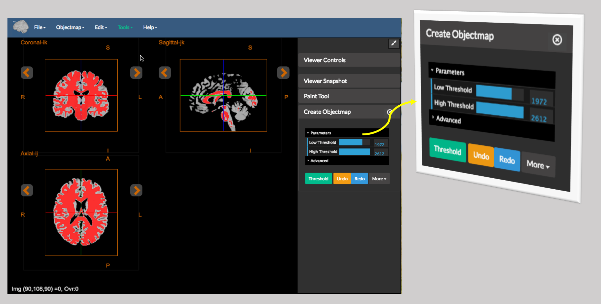

## Image Editor

#### Introduction

The [Image Editor](https://bioimagesuiteweb.github.io/webapp/editor.html) tool shown above is a tool to create and visualize interactive segmentations, as well as to correct existing segmentations (e.g. skull stripping). This tool uses the core orthogonal viewer described in ([Displaying Images](viewers.md). It has the following additional features:

* Overlays are explicitly labeled as Objectmaps (i.e. the value in this overlay image is explicitly a tag for a region)
* The ability to edit the object maps using the "Paint Tool".
* Provision of selected set of modules (Create Objectmap, Morphology Operations, Regularize Objectmap, Mask Image) for modifying object maps.
* The integration of the VOI (`Volume-of-interest`) analysis tool that uses the current objectmap to analyze the underlying image (which could be a timeseries as opposed to just a static image).

#### Creating an Objectmap

One can create an objectmap on one of three ways:

* Load it from an existing binary file. (Under `Objectmap` | Load)
* Create it by manually defining the regions using the `Paint Tool`
* Create it by thresholding the underlying image. The example above shows the use of the `Create Objectmap` tool (essentially a binary thresholding tool) to create the obejctmap.

#### Detailed Operations

Once an objectmap is n memory it can displayed and manipulated using tools provided in the `Image Editor` Tool. The figure above highlights five different pieces of functionality (accessible from the `Tools` menu) as follows:

* A: Overlay color mapping: Here we assume explicitly that the overlay is an objectmap hence the only display/color mapping option available is the `Opacity`. 
* B: The Paint Tool: this is the core of the BioImage Suite Web interactive segmentation tools. Essentially this is a smart paint-brush tool where the user selects a color (6 shown below plus more can be accessed by pressing the `...` button) and paints over the image to create/edit an objectmap.

The following is a brief description of the functionality included in this:

* The `Enable` toggle. If this is `on` then the paint tool receives mouse input and uses it to `paint` over the image (edit the objectmap). If this is turned to `on` the paint tool is highlighted with a red background color (as shown in the picture). 
* The `Overwrite` toogle. If this is `on` then regions already defined may be erased by painting over them. If not, one can only paint where the objectmap is `zero` or `background`.
* `3D Brush` -- if on the painting is done with a brush that extends to multiple slices, otherwise the image is colored only on the current slice. (This could be any of the three orthogonal slices shown in the viewer.)
* `Threshold` -- if on then the image is colored in, only if the intensity is between the `Min Threshold` and `Max Threshold` (selected below).
* `Connect` -- if on and if `threshold` is on then the paintbrush only fills in voxels between the thresholds and who are `connected` to the central voxel.
* `Brush Size` -- sets the brush size in voxels.
* The colorbar `[0][1][2][3][4][5][6][..]` allows the user to select the color to paint. The color `black` selected by pressing the  `[0]` button is the eraser, provided that `Overwrite` is `ON`.
* Finally the editor can perform undo and redo operations, as needed, using the `Undo` and `Redo` buttons.

C. The Morphology Operations Tool -- this performs mathematical operations such as `erode`, `dilate`, `median`, `connect` (seed connectivity from current cross-hairs) etc on 0/1 objectmaps. If the objectmap contains multiple colors then they will all be converted to 0 or 1.

D. The Regularize Objectmap Tool -- this magic tool performs markov random field regularization to smooth manually painted regions. It was developed for the construction of the Yale Brodmann atlas image. (You can load this under Obejctmap | Load Yale Brodmann Atlas.) To get a desired level of smoothness, set the smoothness value and press `Smooth`.

E. The Mask Image Tool -- this can be used to mask the underlying anatomical image with the objectmap to mask out all parts of the image outside the mask (if `Inverse` is set to `Off` ). Setting `Inverse` to `On` allows one to mask the region inside the objectmap. Before masking, the objectmap must be binarized by thresholding it using the threshold set using the `Threshold` slider.

Given an objectmap and a 4D image we can generate image timeseries plots as shown above. To invoke this control go to 'Objectmap | VOI Analysis'. By default, the graph shows the average intensity in each region over time. There are five buttons at the bottom of this which perform the following operations:

* Plot VOI Values -- this is the default operation. If the underlying anatomical image is 4D the result is a plot like the figure above. If it is a 3D image, then a bar chart is generated instead.

* Plot VOI Volumes -- This creates a bar chart of VOI region volumes.

* Export as CSV -- this outputs the data used in the plots as a comma-separated file (CSV) for import into Excel/Matlab etc. for more detailed plotting.

* Save Snaphot -- saves the current plot as a .png image file

* Close -- closes the VOI Timeseries plotter window.

