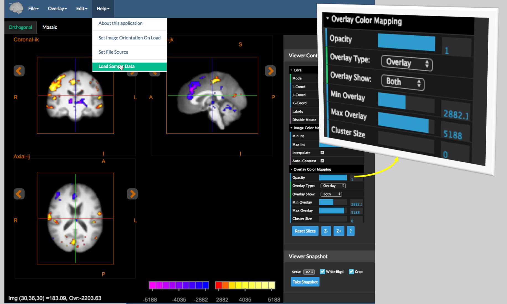

## The Overlay Viewer Application

All viewers can display overlays. The [Overlay Viewer](https://bioimagesuiteweb.github.io/webapp/overlayviewer.html) is particularly optimized for this task. This is shown below.

### Creating Overlays

The overlay viewer tool is a dual viewer that shows functional overlays in both an `Orthogonal` (three orthogonal slice viewer shown above) and a `Mosaic` (multiple parallel slices -- see below) viewer which are synchronized to have the same color mapping scheme.

To try this out, open the application from the main BioImage Suite web page (under `Applications| Overlay Viewer`) and then under `Help`, select `Load Sample Data`. This will load a sample anatomical/functional image pair. (You may load your own images using `Image|Load Image` and `Overlay|Load Overlay`. As discussed above, once an overlay image is loaded, the `Viewer Controls` have an additional set of controls labeled `Overlay Color Mapping` (shown on the right). The controls here perform the following tasks:

* `Opacity` - the relative opacity for 0 (completely transparent) to 1 (fully opaque). Use this to partially show the anatomy under the functional map if desired.
* `Overlay Type` -- the overlay can be displayed using a number of different color maps. These are
    * `Objectmap` -- this is used for displaying sementation objectmaps. The overlay is rendered using a rainbow-like lookup table.
    * `Overlay` and `Overlay2` -- these are slightly different variants of colormaps used to display functional images. The mapping (explicitly shown in the colorscale in the viewer -- bottom right -- is performed as follows):
        * If `Overlay Show` is set to `Both` both positive and negative values are shown otherwise either only positive or only negative values are shown.
        * `Min Overlay` : parts of the image whose intensity is below this (in an absolute sense) is displayed in a completely transparent color (not shown effectively).
        * `Max Overlay` : values above these are saturated.
        * `Cluster Size` : if this is greater than 0 then cluster filtering is performed to eliminate `small` blobs.
    * `Red`, `Green`, `Blue`, `Orange`, `Gray` -- this display the image using an anatomical style mapping. This is useful for overlaying two anatomical images to check registration results etc. In this setting, no clustering is performed and the colorscale is hidden.

_Note_: In the bottom corner of the viewer, the text ``Img (30,36,20) = 183.09, Ovr=-2203.83` now shows the intensity of both the anatomical image (183.09) and the overlay image (-2203.83).

---

## The Atlas and Cluster Tools

These tools allow one to further analyze a functional overlay. They can be accessed under the `Edit` menu using the `Atlas Tool` and `Cluster Tool` options respectively.

#### The Atlas Tool

The atlas tool provides information about the location under the viewer crosshair (in the Orthogonal Viewer only). Each time a new point is navigated to the atlas tool shows real time info about the point under the crosshairs. See the figure below for an example:

The definition of lobes and Brodmann areas derives from some of our prior work (see the [MNI2TAL](./tools/mni2tal.md) application for references and details. The Networks are derived from the work of Power et al, Neuron 2011.). The software detects if the image is in the space of one of its existing atlases (by using the image dimensions in mm -- the only one currenly available is the "human brain atlas")and automatically provides the information. If the image is not in MNI space, for example, then no information can be provided.

#### The Cluster Tool

The cluster tool provides an easy way to examine the larger functional clusters in your data. Prior to using this, one must cluster the functional overlay by setting the `cluster threshold` in `Viewer Controls`/`Overlay Color Mapping` as described previously in this document. Once a cluster threshold is set, the cluster tool will automatically list the clusters that survive the thresholds (or the largest 25 if there are more). This is displayed in the left sidebar as shown in the figure below. Click on the coordinates (in green) of any cluster to navigate to the peak activation inside this cluster. The able may be saved to a `csv` text file by clicking on the `Save Table` button that is located at the botom of the table.

---

### Mosaic Viewer 

This application can also be switched to `Mosaic` view by clicking the `Mosaic` Tab (just below the menu). Please note that the cluster and atlas tools do not work within the mosaic viewer tab, as this does not have a concept of current location (or cross hairs).

This shows multiple parallel slices of a particular orientation (selected using `Plane`). You may set the number of rows and columns, the first slice and increment (which may be negative). The colormapping controls are identical to the orthogonal (3-slice view) and is synchronized between the `Orthogonal` and `Mosaic` tabs.

