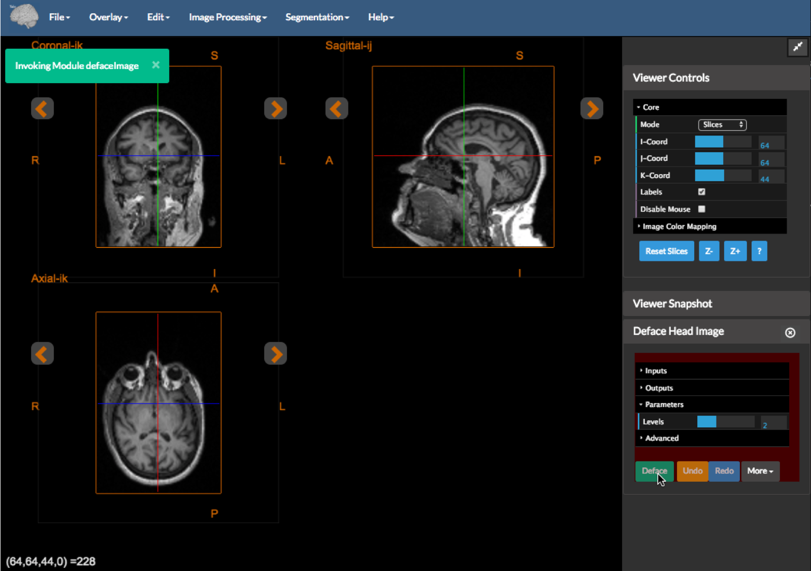
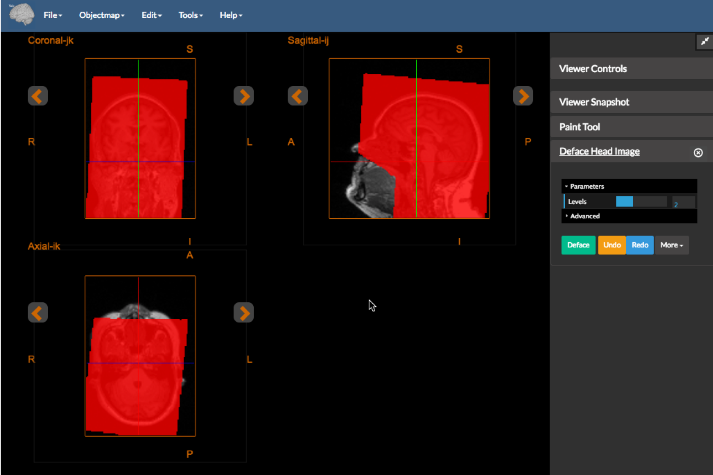
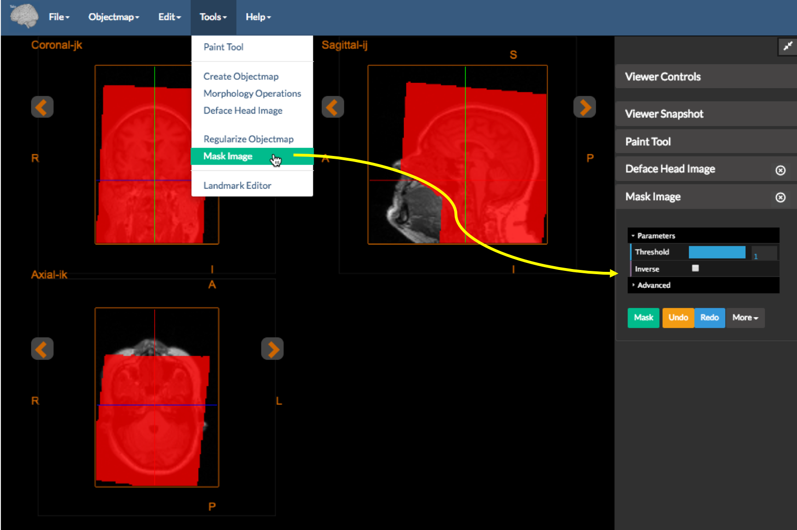

# Image Defacing

This is a common procedure required to fully anonymize an MR brain image. This procedure masks out the face in an MRI making it impossible to "recognize" the subject (if the image is volume rendered or the face surface is extracted).
Our implementation derives from [the OpenfMRI Project](https://github.com/poldrack/openfmri/tree/master/pipeline/facemask). We use some data from their source code as well.

_Note:_ If you need help with the basics of BioImage Suite Web's viewers, please see [the intro to viewers](../viewers.md).

___

## Method 1 — Simple Version

This is a a fully automated process:

A. Open the [orthogonal viewer](https://bioimagesuiteweb.github.io/webapp/viewer.html) tool in BioImage Suite Web.

B. Under `File` menu select the `Load Image` option and then load the image you would like to deface. Alternatively, drag and drop your file into the viewer

_Figure 1: A raw, identifiable MRI and the `Deface Head Image` tool in the menu and sidebar._

C. Under the `Segmentation` menu, select `Deface Head Image`. This will open the `Deface Head Image` Tool and place it in the sidebar as in Figure 1.

_Figure 2: The image during the defacing process. This may take a moment!_

D. Press the "Deface" button (in Green) — this is under the mouse cursor in the image above

E. Wait. This might take a minute or so depending on the speed of your computer. __Please note that all processing is done locally. No data is ever uploaded to any of our servers__.

_Figure 3: The defaced image. The anonymized image should be the area of the image tinted brown._

F. Once the defacing process is completed, the result will be overlaid on the original using a brownish colormap. You can see that in the sagital view above the overlay is missing the face region, indicating that defacing was successful.

G. To save the result, save the overlay image using the `Overlay` -> `Save Overlay`.

_Figure 4: Saving the overlay._
___

## Method 2 — The more Complicated Version with Editing

This is a version of the method above that allows for manual editing and masking.

Repeat steps A-E as above, __but__ use the [Image Editor](https://bioimagesuiteweb.github.io/webapp/editor.html) tool instead. The only difference is that the `Deface Head Image` option is located under the `Tools` menu.

_Figure 5: The defacing tool running in the editor._

Once the defacing process is completed you will get an editable mask shown in red in the figure above. This can be edited using the `Paint Tool` (see [its description](../imageeditor.md) for more details).

_Figure 6: Where to find the masking tool in the editor._

Once you are happy with the edited mask you may create the defaced image using the `Mask Image` tool. Press the green `Mask` button to initiate the process.

_Figure 7: The mask (A), viewer controls which will let you control the opacity of the mask (B), the underlay displayed under the mask (C), and where to find the `Save Image` option (D)._

When the masking is done you may see something like the view shown in (A) of Figure 7, which may not be what you expect. This is because the mask is completely opaque and hides the image — you can show the underlay by adjusting the `Opacity` to something smaller than 1 in the Viewer Controls (B). This should produce something that looks more like the defaced image in (C). You may save this image the same way you would with any image in BioImage Suite (D).

