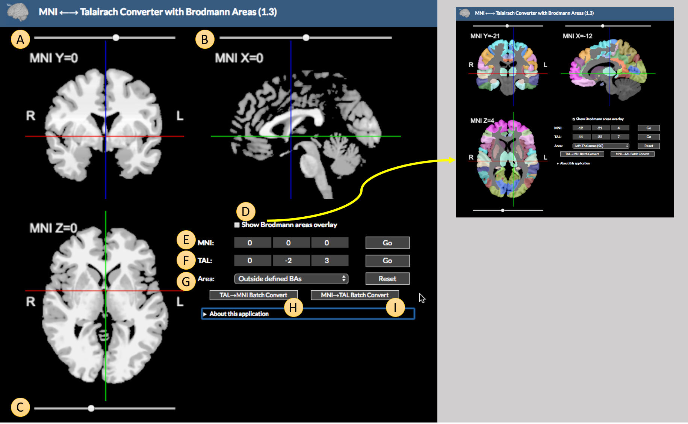

# The MNI <-> Talairach Tool

This [simple tool](https://bioimagesuiteweb.github.io/webapp/mni2tal.html) allows a user to map from MNI to Talairach coordinates and back as well as obtain information about the location of any point in this [`MNI (Colin)`](https://insights.ovid.com/crossref?an=00004728-199803000-00032) Brain image.

To open the application, go to its web page at [https://bioimagesuiteweb.github.io/webapp/mni2tal.html](https://bioimagesuiteweb.github.io/webapp/mni2tal.html)

_Figure 1: The MNI2Tal tool._

The controls are as follows:

* A,B,C — These sliders allow you to set the MNI X,Y and Z coordinates respectively. Alternatively, you may click in the viewer directly to change the cross hairs as in the orthagonal viewer.

* D — If this is enabled, the Broadman area atlas are overlaid on the anatomy as shown in the smaller view to the right.

* E — This is the MNI Coordinates control. You may enter the X, Y and Z coordinates directly in the text boxes in this line and either press the enter or the `Go` button to navigate to this location. 

* F — This is the same as E but you enter Talairach Coordinates instead.

* G — This allows you to select a Brodmann area. The viewer cross hairs will go the centroid of the area.

Any changes to E, F , G or the viewer will update all of these. So any changing in MNI coordinates will result in updated values in (F) and (G).

* H and I — These buttons allow you to load a `.csv` file containing a list of either Talairach or MNI coordinates (one point per line) and perform a batch conversion. A `.csv` file will be saved with the result.

### Application Info

The MNI to Talairach mapping is from [Lacadie et al. NeuroImage 2008](https://www.ncbi.nlm.nih.gov/pmc/articles/PMC2603575/). The Brodmann area definitions are from the following abstract: C.M. Lacadie, R. K. Fulbright, J. Arora, R.T.Constable, and X. Papademetris. Brodmann Areas defined in MNI space using a new Tracing Tool in BioImage Suite. Organization for Human Brain Mapping, 2008.

