# Creating a New AWS Bucket

BioImageSuite Web is capable of reading files from a user's AWS Buckets, but configuring this properly requires a bit of setup. This document will explain the most efficient way to create an Amazon AWS account, set up your bucket, and configure it to work with BioImage Suite Web.

## Creating an AWS Account 

The first step to creating a bucket is to create an Amazon AWS account at [the following link](https://aws.amazon.com/console/). Click the 'Sign In to the Console' button at the top right then click 'Create a new AWS account' just below the blue 'Sign in' button. This will begin a tutorial that will guide you through the process of creating a new AWS Account. Bear in mind that this may require linking a credit card, though what BioImageSuite requires shouldn't exceed the free usage limits.

_Figure 1: The two screens you will see on your way to creating an AWS Account_

### Identity Pool

An Identity Pool associates a particular account with a particular application and provides credentials to allow its users authenticated access to its resources. In this case, your Identity Pool will allow BioImageSuite to know that it's you or another authenticated person attempting to access resources in your bucket. 

Start by finding the Cognito item in the Amazon AWS dashboard (the screen that displays when you log into the Amazon AWS console), then select 'Manage Identity Pools' once inside. 

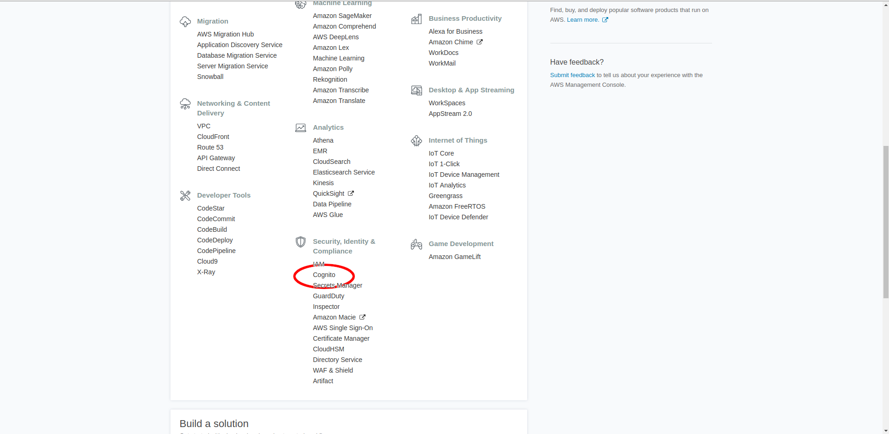
_Figure 6: The Amazon Cognito menu item on the dashboard (located all the way down the page)._

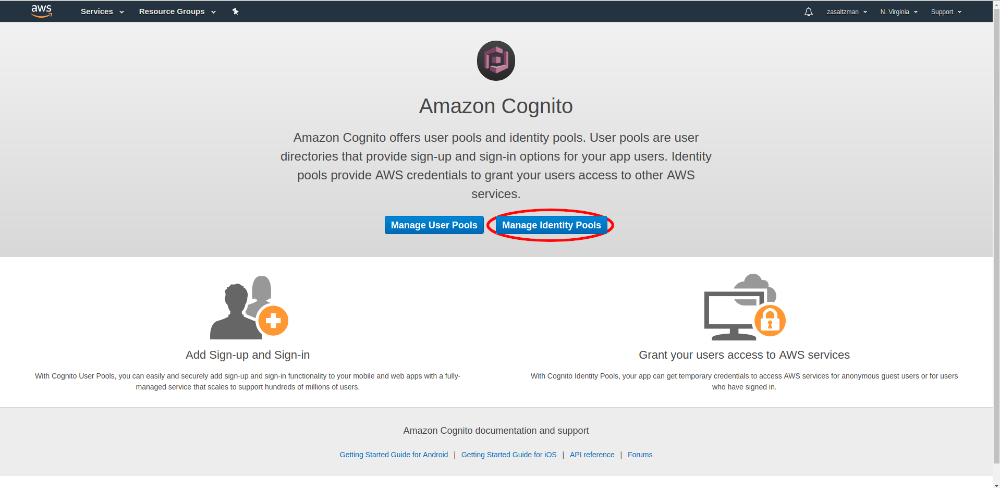
_Figure 7: The Amazon Cognito main menu._

Create your Identity Pool selecting Cognito as the identity provider. Enter the following:

* the BioImageSuite User Pool ID — us-east-1_BAOsizFzq  
* The BioImageSuite App Client ID — 5edh465pitl9rb04qbi37csv8e. 

This will associate your identity pool with BioImageSuite.

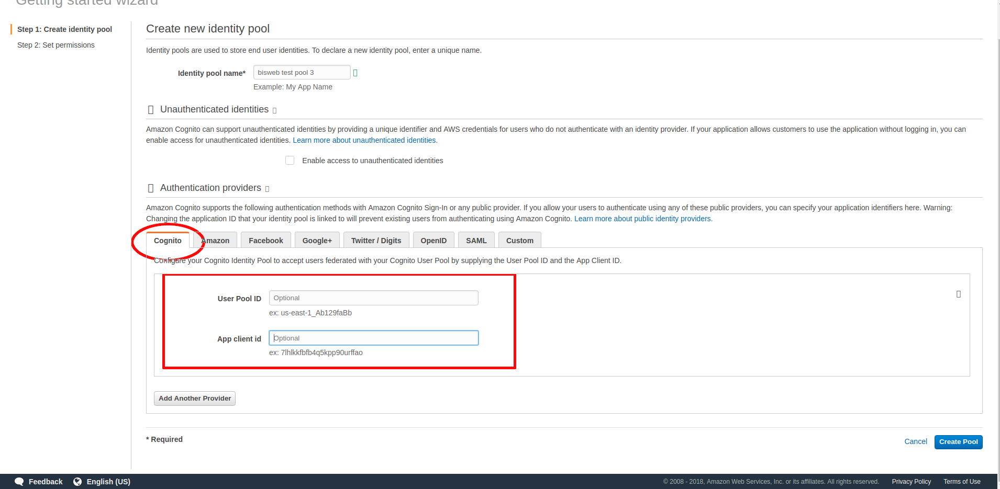
_Figure 8: The identity pool creation page with the relevant authentication provider sections highlighted._

The last step is to create your authentication roles, [which are referenced in the Bucket Policy](#bucket-policy). These names can be anything you'd like but it's recommended to leave the defaults. Note that BioImageSuite uses only the authenticated role, not the unauthenticated role.

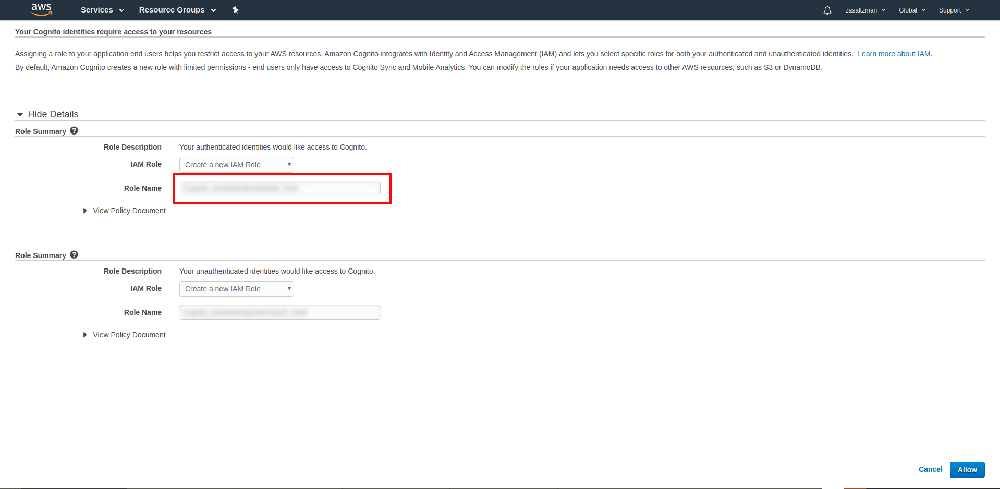
_Figure 9: The Identity Pool role page, with the relevant role highlighted in red._

## Creating an S3 Bucket

Find S3 on the console's dashboard and click the link. 

_Figure 2: The AWS Console with the S3 button highlighted._

Once in the main S3 menu, click the 'Create bucket' button and follow the prompts to configure your bucket. Note that BioImageSuite does not currently support encrypted buckets, but this may change in a future release. 

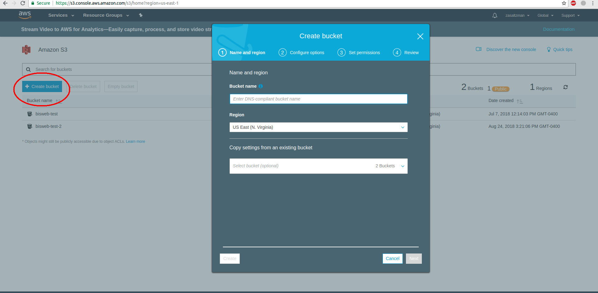
_Figure 3: The 'Create Bucket' button and the prompt it will open._

Once the bucket is created you will need to set two properties to allow it to work BioImageSuite: the Bucket Policy and the CORS configuration.

#### Bucket Policy

The bucket needs to be associated with the BioImageSuite application in order to be accessible from the web browser. This is done using [Amazon Cognito Identity Pools](https://docs.aws.amazon.com/cognito/latest/developerguide/cognito-user-identity-pools.html) to provide security and a unified authentication framework. 

We will have to create an Identity Pool associated with BioImageSuite for you. Once this is done, add the following lines to your bucket's Bucket Policy: 

    {
        "Version": "2012-10-17",
        "Statement": [
            {
                "Effect": "Allow",
                "Principal": {
                    "AWS": "arn:aws:iam::<ACCOUNT_ID>:role/<COGNITO_IDENTITY_POOL_AUTH_ROLE>"
                },
                "Action": "s3:ListBucket",
                "Resource": "arn:aws:s3:::<S3_BUCKET_NAME>"
            },
            {
                "Effect": "Allow",
                "Principal": {
                    "AWS": "arn:aws:iam::<ACCOUNT_ID>:role/<COGNITO_IDENTITY_POOL_AUTH_ROLE>"
                },
                "Action": [
                    "s3:GetObject",
                    "s3:PutObject",
                    "s3:DeleteObject"
                ],
                "Resource": "arn:aws:s3:::<S3_BUCKET_NAME>/*"
            }
        ]
    }

The parts of the policy surrounded by carats will need to be replaced by values relevant to your bucket and values specific to the BioImageSuite User Pools that cannot be published here. 

* <ACCOUNT_ID> designates your Account Id. See [Appendix B](#appendix_b) for more information.

* <COGNITO_IDENTITY_POOL_AUTH_ROLE> designates the name of the authentication role that will be created along with your identity pool. See [the section about identity pools](#identity-pool) for more information.

* <S3_BUCKET_NAME> designates the name of your S3 bucket.

More information about what setting a Bucket Policy can do can be found in the [official S3 documentation](https://docs.aws.amazon.com/AmazonS3/latest/dev/using-iam-policies.html).

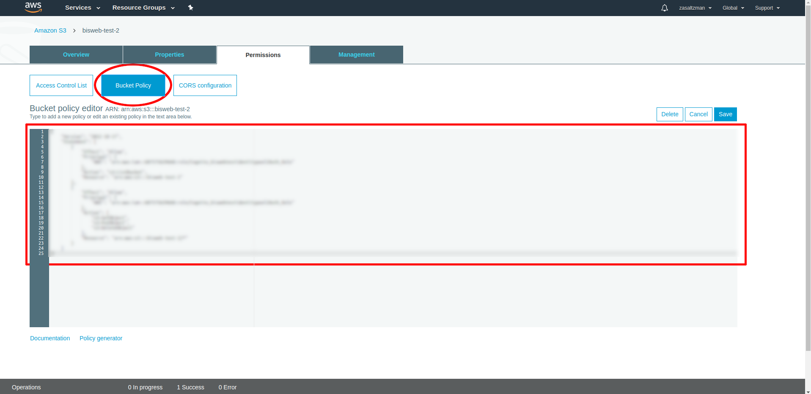
_Figure 4: The bucket policy screen found under Permissions->Bucket Policy, with the Bucket Policy button and policy editor screen outlined in red. Note that the editor itself is blurred to hide certain information_

### CORS Configuration

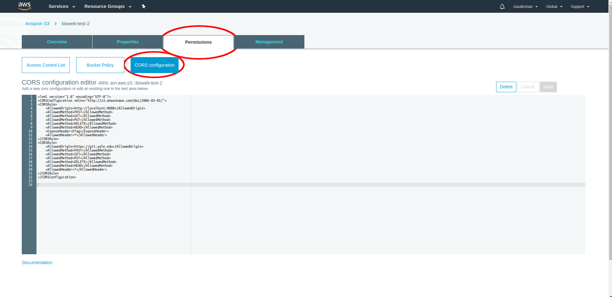
_Figure 5: The CORS Editor screen, accessible through Preferences->CORS Configuration from the S3 dashboard._

The Bucket Policy controls what resources external to S3 can access the bucket by authenticating users and specifying which users can do what. The CORS (Cross-Origin Resource Sharing) Configuration defines exceptions to a security policy known as the [Same Origin Policy](https://en.wikipedia.org/wiki/Same-origin_policy) that is common to all applications that live on the web.

 In essence, the Same Origin Policy dictates that applications from one webpage may not access data from applications in another webpage unless they originate from the same source. This would prevent BioImageSuite, which currently lives on a [Git Pages](https://pages.github.com/) server, from accessing data that lives in your S3 bucket — thus you must add BioImage Suite's URL as a trusted domain in your CORS configuration. You may read about [this topic in detail](https://docs.aws.amazon.com/AmazonS3/latest/dev/cors.html) should you wish, but adding the following lines is sufficient to allow BioImage Suite to access your bucket.:

    <?xml version="1.0" encoding="UTF-8"?>
    <CORSConfiguration xmlns="http://s3.amazonaws.com/doc/2006-03-01/">
    <CORSRule>
        <AllowedOrigin>https://bioimagesuiteweb.github.io</AllowedOrigin>
        <AllowedMethod>POST</AllowedMethod>
        <AllowedMethod>GET</AllowedMethod>
        <AllowedMethod>PUT</AllowedMethod>
        <AllowedMethod>DELETE</AllowedMethod>
        <AllowedMethod>HEAD</AllowedMethod>
        <AllowedHeader>*</AllowedHeader>
    </CORSRule>
    </CORSConfiguration>

## Conclusion

Once these steps are complete your bucket may be accessed through the AWS Bucket Selector within BioImageSuite. This will require you to enter your Identity Pool ID and Bucket Name the first time you add the bucket, but these settings will be retained in the browser cache afterwards. Happy processing!

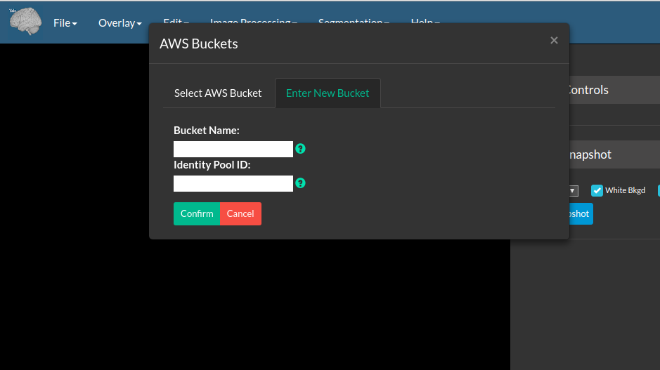
_Figure 10: The BioImageSuite AWS Bucket selector, accessible through Help->AWS Selector_

## Appendices

### Appendix A: Finding your Identity Pool ID

All AWS resources have a unique identifier associated with them. You will need the ID of your identity pool in order for BioImageSuite to be able to access resources associated with your account. 

The first step is to go to the AWS dashboard find your list of Identity Pools (see [the section on Identity Pools](#identity-pool) for more details). Once inside the dashboard, find your Identity Pool that corresponds to BioImageSuite and go to its settings. The Identity Pool ID should be listed there.

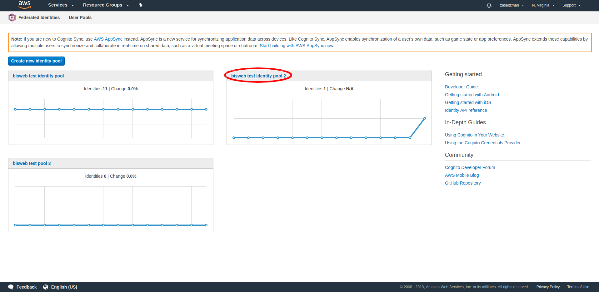
_Figure 11: The Identity Pool Selection Screen. If, for example, "bisweb test identity pool 2" was the Identity Pool associated with your S3 Bucket, this would be where you click._

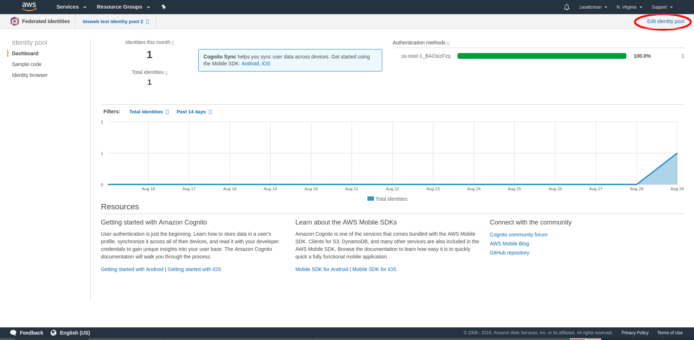
_Figure 12: The dashboard for an Identity Pool and where to click to display its settings._

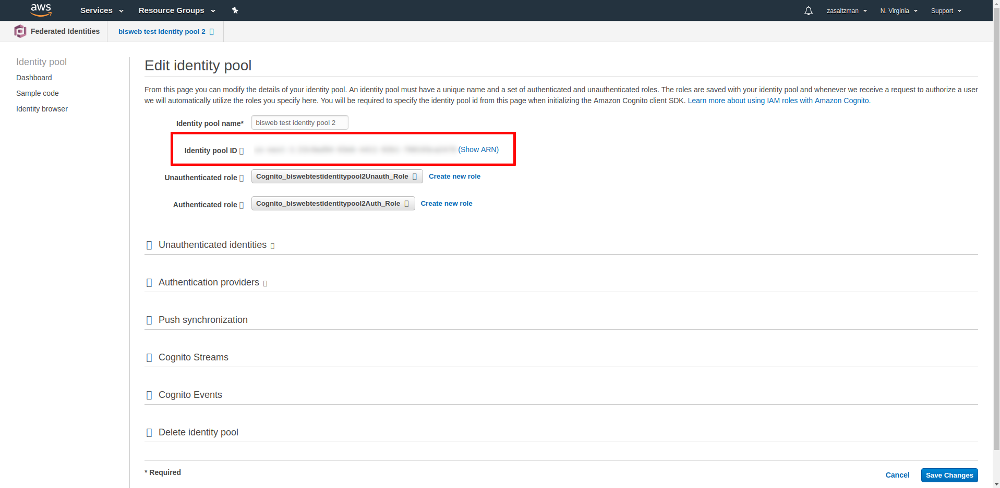
_Figure 13: Where to find the ID associated with the Identity Pool. Note that this one has been blurred out, but yours will be here._

### Appendix B: Finding your Account ID

Click the tab labeled with your username in the top right of the Amazon S3 console and select 'My Account'. Your Account ID will be displayed at the top, under the Account Settings tab.

_Figure 14: The tab that contains the 'My Account' item. Note that in your AWS console, this will be your name._

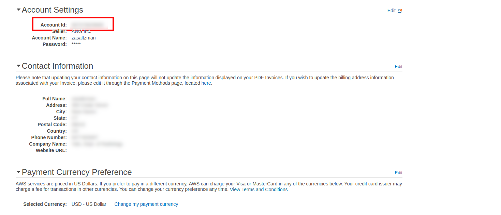
_Figure 15: Your Account ID on the 'My Account' page. Your other details will appear here, but have been blurred out here for privacy reasons._